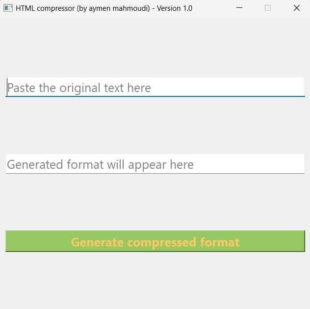

# Html-text-Compressor

## Description
This tool permits the reduction of the size of the HTML file by saving space in the HTML file via some processes like removing the text line breaks, removing tab spaces, etc.

## Installation
To run the GUI, I recommend setting up a Python virtual environment (tested and verified under the 3.8.0 version) and adding the required libraries using the following command after cloning the rep (you can just download the rep in case you don't use git):
```console
pip install -r requirements.txt
```
## Usage
You need to copy the raw HTML script in the entry box and press the button. The maximum length of entry and output boxes is 100,000 characters.

 

## Roadmap
 <ul>
  <li>Add a load button to import the HTML file</li>
  <li>Transform the project on a desktop application</li>
</ul> 

## Support and Contributing
Let me know if you have any suggestions/ideas to enhance those scripts or add further settings. Your suggestions are warmly welcomed.
<br><br>
In case of a problem, It is strongly recommended to post an issue. For a more confidential demand, don't hesitate to email me.


